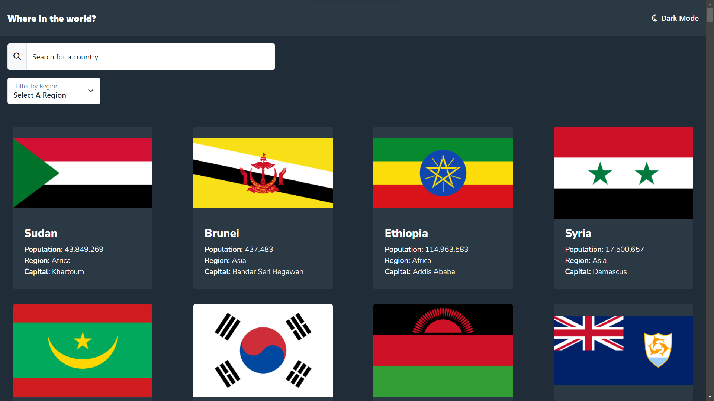

# Frontend Mentor - REST Countries API with color theme switcher solution

This is a solution to the [REST Countries API with color theme switcher challenge on Frontend Mentor](https://www.frontendmentor.io/challenges/rest-countries-api-with-color-theme-switcher-5cacc469fec04111f7b848ca). Frontend Mentor challenges help you improve your coding skills by building realistic projects. 

## Table of contents

- [Overview](#overview)
  - [The challenge](#the-challenge)
  - [Screenshot](#screenshot)
  - [Links](#links)
- [My process](#my-process)
  - [Built with](#built-with)
  - [What I learned](#what-i-learned)
  - [Continued development](#continued-development)
  - [Useful resources](#useful-resources)
- [Author](#author)
- [Acknowledgments](#acknowledgments)

## Overview

### The challenge

Users should be able to:

- See all countries from the API on the homepage
- Search for a country using an `input` field
- Filter countries by region
- Click on a country to see more detailed information on a separate page
- Click through to the border countries on the detail page
- Toggle the color scheme between light and dark mode *(optional)*

### Screenshot



### Links

- Solution URL: [GitHub](https://github.com/victor247k/REST-Countries-API-with-color-theme-switcher)
- Live Site URL: [Local host](http://127.0.0.1/)

## My process

### Built with

- Semantic HTML5 markup
- CSS custom properties
- Flexbox
- CSS Grid
- Mobile-first workflow
- Python
- [RESTful API](https://restcountries.com/) - RestCountries API
- [Flask](https://flask.palletsprojects.com/en/3.0.x/https://reactjs.org/) - Python Web Framework
- [Jinja2](https://jinja.palletsprojects.com/en/3.1.x/https://nextjs.org/) - templating engine
- [Bootsrap](https://getbootstrap.com/https://styled-components.com/) - For styles
- [Font Awsome](https://fontawesome.com/) - For icons
- [Google Fonts](https://fonts.google.com/) - For fonts
- [ChatGPT](https://chat.openai.com/) - For help


### What I learned

I mostly did this to practice using python and flask and git, but actually got some experience with javascript as well and css, oh ofcoarse you cant ignore the elephant in the room - the RESTful API, i had a lot of fun trying to implement this, and using jinja was a big help for itereting through all of those html elements, but now that i think about it, i could've used js for everything, but like i've said i wanted to practice using python and flask. 

```html
<p>
  Langueges: 
  
  
      ,
      <span>{{ language }}</span>
       
  
</p>
```
```css
@media (prefers-color-scheme: dark) {
  body {
    background: var(--clr-d-bg) !important;
  }
}
```
```js
class Country {
    constructor (element) {
        this.element = element;
    }

    region() {
        const box = this.element.querySelector(".text");
        const div = box.querySelector("div");
        const region = div.querySelector("#region").innerText;
        return region;
    }

    name() {
        const name = this.element.querySelector(".text");
        return name.querySelector(".countryName").innerText;
    }
}
```
``` py
app = Flask(__name__)
app.jinja_env.filters['format_number'] = format_number

url = "https://restcountries.com/v3.1/all?fields=name,flags,population,region,capital"
response = requests.get(url).json()
```

### Continued development

Use this section to outline areas that you want to continue focusing on in future projects. These could be concepts you're still not completely comfortable with or techniques you found useful that you want to refine and perfect.

I've encountered a lot of problems with CSS and a bit with HTML, i dont know how to structure elements better and how to style them, it's a mess, i think i should just learn to use bootstrap, and for the future i want to use React for front end so i hope that with that i will improve my structure of my html. Oh and i want to learn about UI/UX and designing fundamentals, how to make cool animations and stuff like this.

### Useful resources

- [Flask](https://flask.palletsprojects.com/en/3.0.x/https://reactjs.org/) - This is a lite weight python framework that really helped me and its documentation is very good.
- [Git tutorial](https://youtu.be/HkdAHXoRtos?si=-R8gLEVN65lp0TuChttps://www.example.com) - This helped me learn about git and how to initialize a repository, to add, to commit, and how to push, this guy explains stuff very well.
- [The Done Manifesto](https://medium.com/@bre/the-cult-of-done-manifesto-724ca1c2ff13) - The best rules for productivity.

**Note: Delete this note and replace the list above with resources that helped you during the challenge. These could come in handy for anyone viewing your solution or for yourself when you look back on this project in the future.**

## Author

- Bio Link - [victor](https://dose.lol/victor)
- Frontend Mentor - [@victor247k](https://www.frontendmentor.io/profile/victor247k)

## Acknowledgments

I am thankful for this challange, it was quite difficult and it made me realize that I should learn more about design and how to style. Also I am grateful for the Done Manifesto which served as the main motivation of not procrastinating on doing this.
